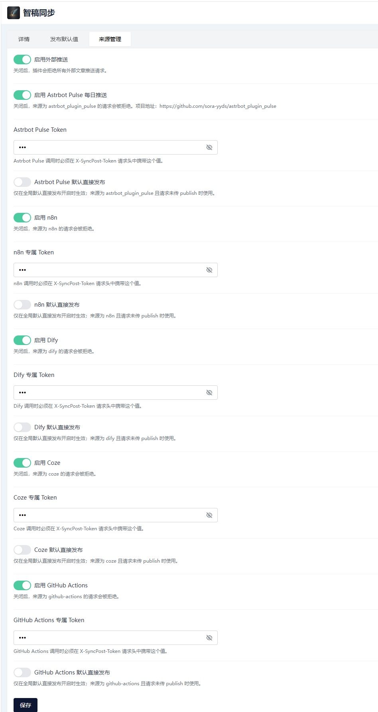
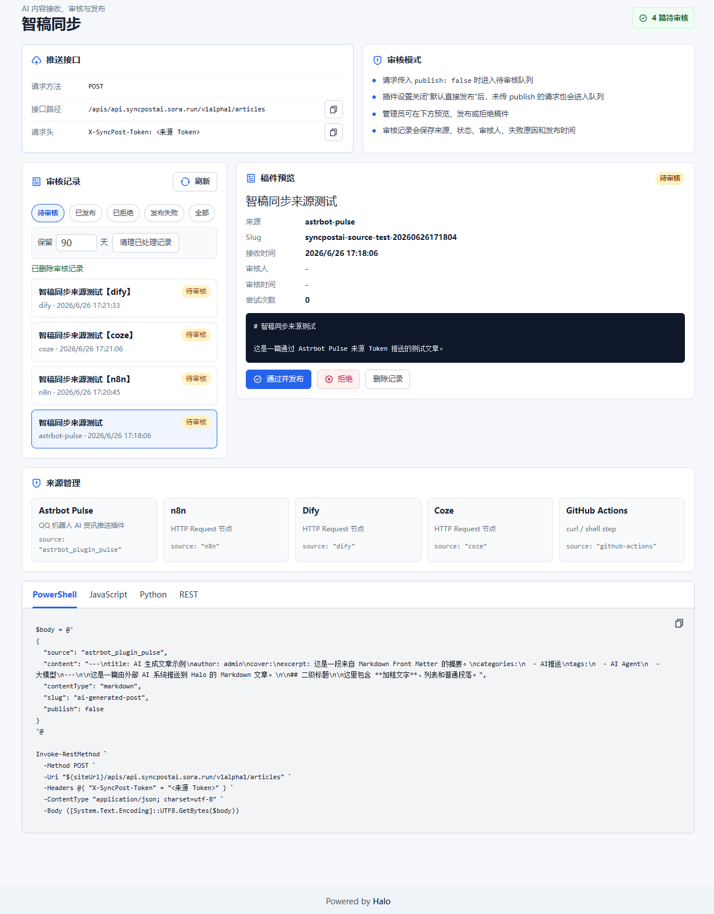

# 智稿同步
智稿同步（SyncPostAI）是一个 Halo 2.x 插件，用于接收外部 AI、自动化脚本或第三方系统推送的文章，并在 Halo 后台完成审核、发布和审计。

适用场景：

- AI 写作工具生成文章后，先进入待审核队列，再由管理员确认发布。
- 自动化脚本定时把 Markdown 文件发布到博客。
- 第三方内容系统把文章同步到 Halo。
- 其他 Halo 插件通过 HTTP 接口提交待发布稿件。

## 功能特性

- 通过公开接口推送文章。
- 使用 `X-SyncPost-Token` 请求头进行 Token 鉴权。
- 支持待审核队列，关闭默认直接发布或请求传入 `publish: false` 时不会立即创建公开文章。
- 支持在 Halo 控制台预览、通过发布、拒绝外部推送稿件。
- 支持按状态筛选审核记录、删除单条记录、按保留天数清理已处理记录。
- 支持记录推送来源、接收时间、审核状态、审核人、失败原因和发布结果。
- 支持 `markdown`、`html`、`text` 三种内容类型。
- Markdown 自动转换为 HTML。
- 支持读取 Markdown 顶部的 Front Matter。
- 支持从 Front Matter 读取标题、作者、封面、摘要、分类和标签。
- 未传标题时自动兜底：Front Matter 标题、正文一级标题、正文片段、`未命名文章`。
- 支持随机封面图集。
- 发布成功后返回文章完整访问地址 `articleUrl`；进入审核队列时返回 `reviewName`。

## 界面截图





## 安装

1. 下载或构建插件 jar。
2. 进入 Halo 后台。
3. 打开「插件」页面。
4. 上传并启用智稿同步插件。
5. 进入插件设置，完成推送配置。

本地构建命令：

```powershell
.\gradlew.bat build
```

构建后的 jar 位于：

```text
build/libs/
```

## 插件设置

| 配置项 | 说明 |
| --- | --- |
| 默认作者 | 请求和 Front Matter 都未指定作者时使用，从 Halo 已有用户中选择。 |
| 审核记录保留天数 | 用于清理已发布、已拒绝、发布失败的审核记录；待审核记录不会被自动清理。 |
| 默认分类 | 请求和 Front Matter 都未指定分类时使用。 |
| 默认标签 | 请求和 Front Matter 都未指定标签时使用。 |
| 默认直接发布 | 站点级直接发布总开关。关闭后，所有来源都会进入待审核队列。 |
| 启用随机封面图集 | 当文章未指定封面时，从封面图集中随机选择封面。 |
| 封面图集 | 每一项填写一个可访问的图片 URL。 |
| 启用外部推送 | 位于「来源管理」。关闭后，所有外部推送请求都会被拒绝。 |

请妥善保管各来源 Token，不要公开到网页、仓库或客户端代码中。

## 来源管理

插件内置以下来源预设：

| 来源 | `source` 值 | 平台地址 | 平台侧调用方式 | 插件侧能力 |
| --- | --- | --- | --- | --- |
| Astrbot Pulse | `astrbot_plugin_pulse` | <https://github.com/sora-yyds/astrbot_plugin_pulse> | Astrbot 插件配置 | 独立启用开关、专属密钥、默认发布策略 |
| n8n | `n8n` | <https://n8n.io/> | HTTP Request 节点 | 独立启用开关、专属密钥、默认发布策略 |
| Dify | `dify` | <https://dify.ai/> | HTTP Request 节点 | 独立启用开关、专属密钥、默认发布策略 |
| Coze | `coze` | <https://www.coze.com/> | HTTP Request 节点 | 独立启用开关、专属密钥、默认发布策略 |
| GitHub Actions | `github-actions` | <https://github.com/features/actions> | workflow 中使用 `curl` 或脚本请求 | 独立启用开关、专属密钥、默认发布策略 |

来源管理规则：

- 所有来源平台默认关闭，需要在插件设置中启用并选择该来源密钥后才能接收请求。
- 来源密钥使用 Halo Secret 资源保存，密钥中必须包含名为 `token` 的字段。
- 请求体中的 `source` 会用于匹配来源预设。
- 来源关闭后，对应 `source` 的请求会被拒绝。
- 请求头 `X-SyncPost-Token` 必须使用对应来源密钥中 `token` 字段的值。
- 未识别来源或未选择密钥的来源会被拒绝。
- 全局“默认直接发布”关闭时，所有来源都会进入审核队列，即使请求传入 `publish: true` 也不会直接发布。
- 全局“默认直接发布”开启时，请求体没有传 `publish` 的已识别来源会使用该来源的“默认直接发布”设置。

## 数据与隐私

智稿同步会根据你的配置处理以下数据：

- 接收外部请求中的文章标题、正文、摘要、作者、封面、分类、标签、发布状态和来源标识。
- 当需要审核时，将稿件保存到 Halo 的插件数据中，等待管理员处理。
- 管理员审核通过后，将文章、分类和标签写入当前 Halo 站点。
- 在插件设置中保存各来源密钥引用、默认作者、默认分类、默认标签和封面图集配置；实际 Token 保存于 Halo Secret 资源。
- 发布成功后向请求方返回文章资源名、快照名、发布状态和文章访问地址；进入审核队列时返回审核记录名称。

插件不会主动向第三方服务发送站点内容、用户数据、访问日志或推送 Token，也不包含遥测、统计、广告或远程配置功能。封面图集中的图片 URL 由站点管理员自行配置，文章页面访问这些图片时可能会由浏览器请求对应的图片服务。

从旧版本升级时，如果你之前在来源配置中直接填写过 Token，需要在插件设置中为对应来源重新选择或创建 Halo Secret，并确保 Secret 中包含 `token` 字段。

## 接口地址

```http
POST /apis/api.syncpostai.sora.run/v1alpha1/articles
```

完整地址示例：

```text
https://你的站点域名/apis/api.syncpostai.sora.run/v1alpha1/articles
```

请求头：

```http
Content-Type: application/json; charset=utf-8
X-SyncPost-Token: 你的来源 Token
```

## 请求字段

| 字段 | 类型 | 必填 | 说明 |
| --- | --- | --- | --- |
| `content` | string | 是 | 文章正文。 |
| `contentType` | string | 否 | `markdown`、`html` 或 `text`，默认 `text`。 |
| `title` | string | 否 | 文章标题。优先级高于 Front Matter。 |
| `author` | string | 否 | Halo 用户名。优先级高于 Front Matter 中的 `author` / `auther`。 |
| `cover` | string | 否 | 文章封面图 URL。 |
| `excerpt` | string | 否 | 文章摘要。不传时使用 Halo 自动摘要。 |
| `slug` | string | 否 | 文章别名。建议传入稳定且唯一的值。 |
| `categories` | string[] | 否 | 分类名称列表。不存在时插件会自动创建。 |
| `tags` | string[] | 否 | 标签名称列表。不存在时插件会自动创建。 |
| `publish` | boolean | 否 | 是否直接发布。不传时使用插件设置；为 `false` 时进入待审核队列。 |
| `source` | string | 是 | 推送来源标识，例如 `astrbot_plugin_pulse`、`n8n`、`dify`、`coze`、`github-actions`。 |

请求体字段优先级高于 Markdown Front Matter。

## Markdown Front Matter

当 `contentType` 为 `markdown` 时，可以在 Markdown 文件顶部添加 Front Matter：

```markdown
---
title: 从企业记忆到世界模型：AI Agent 正进入“长期上下文”竞争
author: admin
cover:
excerpt: 今日 AI 动态显示，产业竞争正从单点模型能力转向长期上下文、组织知识、世界模拟与数据质量。
categories:
  - AI推送
tags:
  - AI Agent
  - 大模型
  - 企业AI
  - 世界模型
  - AI评测
---

这里开始写正文。
```

兼容字段：

- `author`：推荐使用。
- `auther`：兼容旧写法。

标题解析顺序：

1. 请求体 `title`
2. Front Matter `title`
3. Markdown 正文第一个 `# 一级标题`
4. 正文前 30 个字符
5. `未命名文章`

封面解析顺序：

1. 请求体 `cover`
2. Front Matter `cover`
3. 插件设置中的随机封面图集
4. 空封面

## 调用示例

<details open>
<summary>REST JSON 示例</summary>

```json
{
  "source": "astrbot_plugin_pulse",
  "content": "---\ntitle: AI 生成文章示例\nauthor: admin\ncover:\nexcerpt: 这是一段摘要。\ncategories:\n  - AI推送\ntags:\n  - AI Agent\n  - 大模型\n---\n\n这是一篇由外部 AI 系统推送到 Halo 的 Markdown 文章。\n\n## 二级标题\n\n这里包含 **加粗文字** 和普通段落。",
  "contentType": "markdown",
  "slug": "ai-generated-post",
  "publish": true
}
```

成功响应：

```json
{
  "success": true,
  "message": "Article published to Halo.",
  "articleName": "ai-generated-post",
  "snapshotName": "ai-generated-post-base-xxxx",
  "status": "published",
  "articleUrl": "https://你的站点域名/archives/ai-generated-post"
}
```

</details>

<details>
<summary>进入审核队列示例</summary>

```json
{
  "source": "astrbot_plugin_pulse",
  "content": "# 今日 AI 资讯\n\n这里是由机器人收集整理的 Markdown 内容。",
  "contentType": "markdown",
  "slug": "daily-ai-news-20260626",
  "categories": ["AI推送"],
  "tags": ["AI", "资讯"],
  "publish": false
}
```

成功进入审核队列时会返回：

```json
{
  "success": true,
  "message": "Article saved to review queue.",
  "articleName": null,
  "snapshotName": null,
  "status": "pending_review",
  "articleUrl": null,
  "reviewName": "review-xxxx"
}
```

之后可以在插件控制台页面预览稿件，并选择“通过并发布”或“拒绝”。

审核记录说明：

- 可以按「待审核」「已发布」「已拒绝」「发布失败」「全部」筛选记录。
- 单条记录可以手动删除。删除审核记录不会删除已经发布的 Halo 文章。
- 「清理已处理记录」只会删除超过保留天数的已发布、已拒绝、发布失败记录，不会删除待审核记录。

</details>

<details>
<summary>n8n / Dify / Coze / GitHub Actions 来源示例</summary>

```json
{
  "source": "n8n",
  "content": "# 自动化工作流推送文章\n\n这里是工作流生成的 Markdown 内容。",
  "contentType": "markdown",
  "slug": "workflow-post-20260626",
  "categories": ["AI推送"],
  "tags": ["自动化"],
  "publish": false
}
```

将 `source` 改为 `dify`、`coze` 或 `github-actions` 即可使用对应来源配置。平台侧只需要向本文档中的推送接口发送 HTTP POST 请求。

</details>

<details>
<summary>PowerShell 示例</summary>

```powershell
$siteUrl = "https://你的站点域名"
$token = "你的来源 Token"
$jsonPath = "$env:TEMP\syncpostai-test.json"

$json = @'
{
  "source": "astrbot_plugin_pulse",
  "content": "# 智稿同步待审核测试\n\n这是一段通过 Astrbot Pulse 来源 Token 推送的 **Markdown** 正文。",
  "contentType": "markdown",
  "slug": "syncpostai-review-test",
  "tags": ["AI", "Markdown"],
  "categories": ["AI推送"],
  "publish": false
}
'@

[System.IO.File]::WriteAllText($jsonPath, $json, [System.Text.UTF8Encoding]::new($false))

curl.exe -X POST "$siteUrl/apis/api.syncpostai.sora.run/v1alpha1/articles" `
  -H "Content-Type: application/json; charset=utf-8" `
  -H "X-SyncPost-Token: $token" `
  --data-binary "@$jsonPath"
```

</details>

<details>
<summary>PowerShell 快速测试待审核队列</summary>

```powershell
$siteUrl = "https://你的站点域名"
$token = "你的 Astrbot Pulse 来源 Token"

$body = @{
  source = "astrbot_plugin_pulse"
  title = "智稿同步来源测试"
  content = "# 智稿同步来源测试`n`n这是一篇进入待审核队列的测试文章。"
  contentType = "markdown"
  slug = "syncpostai-source-test-$(Get-Date -Format 'yyyyMMddHHmmss')"
  categories = @("AI推送")
  tags = @("测试", "Astrbot")
  publish = $false
} | ConvertTo-Json -Depth 10

Invoke-RestMethod `
  -Method POST `
  -Uri "$siteUrl/apis/api.syncpostai.sora.run/v1alpha1/articles" `
  -Headers @{ "X-SyncPost-Token" = $token } `
  -ContentType "application/json; charset=utf-8" `
  -Body ([System.Text.Encoding]::UTF8.GetBytes($body))
```

成功后会返回 `status: pending_review` 和 `reviewName`，然后可以到 Halo 后台「工具 -> 智稿同步」查看待审核稿件。

</details>

<details>
<summary>推送本地 Markdown 文件</summary>

```powershell
$siteUrl = "https://你的站点域名"
$token = "你的来源 Token"
$mdPath = "D:\Articles\demo.md"
$jsonPath = "$env:TEMP\syncpostai-markdown-file.json"

$content = Get-Content -Raw -Encoding UTF8 $mdPath

Add-Type -AssemblyName System.Web.Extensions
$serializer = New-Object System.Web.Script.Serialization.JavaScriptSerializer
$serializer.MaxJsonLength = 2147483647
$escapedContent = $serializer.Serialize($content)

$json = @"
{
  "source": "astrbot_plugin_pulse",
  "content": $escapedContent,
  "contentType": "markdown",
  "slug": "markdown-file-test-$(Get-Date -Format 'yyyyMMddHHmmss')",
  "publish": true
}
"@

[System.IO.File]::WriteAllText($jsonPath, $json, [System.Text.UTF8Encoding]::new($false))

curl.exe -X POST "$siteUrl/apis/api.syncpostai.sora.run/v1alpha1/articles" `
  -H "Content-Type: application/json; charset=utf-8" `
  -H "X-SyncPost-Token: $token" `
  --data-binary "@$jsonPath"
```

插件当前不是上传 `.md` 文件对象，而是读取 Markdown 文件内容后放入 JSON 的 `content` 字段。

</details>

<details>
<summary>Node.js 示例</summary>

```js
const siteUrl = 'https://你的站点域名'
const token = '你的来源 Token'

const response = await fetch(`${siteUrl}/apis/api.syncpostai.sora.run/v1alpha1/articles`, {
  method: 'POST',
  headers: {
    'Content-Type': 'application/json; charset=utf-8',
    'X-SyncPost-Token': token,
  },
  body: JSON.stringify({
    source: 'astrbot_plugin_pulse',
    content: '# AI 生成文章示例\n\n这里是正文，支持 **Markdown**。',
    contentType: 'markdown',
    slug: `ai-post-${Date.now()}`,
    publish: true,
  }),
})

const result = await response.json()
console.log(result.articleUrl)
```

</details>

<details>
<summary>Python 示例</summary>

```python
import time
import requests

site_url = "https://你的站点域名"
token = "你的来源 Token"

payload = {
    "source": "astrbot_plugin_pulse",
    "content": "# AI 生成文章示例\n\n这里是正文，支持 **Markdown**。",
    "contentType": "markdown",
    "slug": f"ai-post-{int(time.time())}",
    "publish": True,
}

response = requests.post(
    f"{site_url}/apis/api.syncpostai.sora.run/v1alpha1/articles",
    headers={
        "Content-Type": "application/json; charset=utf-8",
        "X-SyncPost-Token": token,
    },
    json=payload,
    timeout=30,
)

print(response.json())
```

</details>

## 常见问题

### 为什么返回登录页？

请确认接口路径是：

```text
/apis/api.syncpostai.sora.run/v1alpha1/articles
```

不要使用旧路径：

```text
/apis/api.syncpostai.sora.run/v1alpha1/ai/articles
/apis/api.starter.halo.run/v1alpha1/articles
```

### 为什么返回 `Failed to read HTTP message`？

通常是请求体不是合法 JSON，或者编码不正确。建议：

- 使用 `Content-Type: application/json; charset=utf-8`。
- Windows PowerShell 下先写入 UTF-8 JSON 文件，再用 `curl.exe --data-binary "@文件路径"` 发送。
- 发送前用 `ConvertFrom-Json` 检查 JSON 是否合法。

### 为什么提示文章已存在？

插件会使用 `slug` 生成文章资源名。相同 `slug` 重复推送会返回已存在。测试时建议在 `slug` 后加时间戳。

### 为什么推送后没有直接出现在文章列表？

请检查请求体是否传了 `publish: false`，或者插件设置中是否关闭了“默认直接发布”。这两种情况下，稿件会进入插件控制台的待审核队列，需要管理员通过后才会创建 Halo 文章。

### 为什么没有封面？

请按顺序检查：

1. 请求体是否传了 `cover`。
2. Markdown Front Matter 是否填写了 `cover`。
3. 插件设置中是否启用了随机封面图集。
4. 封面图集里的 URL 是否可以公网访问。

## 相关链接

- 仓库地址：<https://github.com/sora-yyds/SyncPostAI/>
- 问题反馈：<https://github.com/sora-yyds/SyncPostAI/issues>

## 许可证

本项目使用 GPL-3.0 开源协议。
